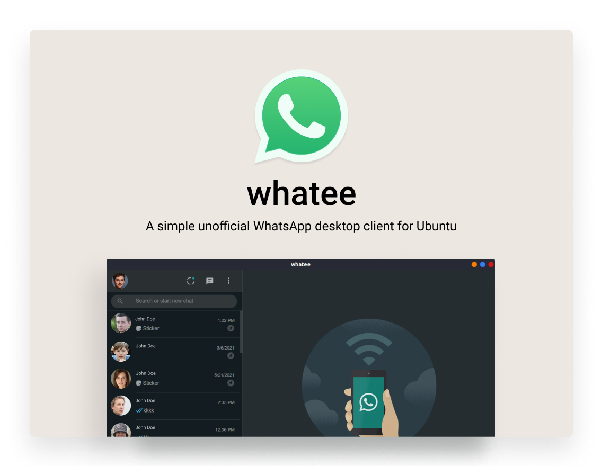

# whatee

This is simple unofficial WhatsApp desktop client for linux.





Note: Check [the offical Electron quick start](https://www.electronjs.org/docs/tutorial/quick-start) if you need to learn the basics about Electron.

Note: Click [here](https://www.whatsapp.com/download?lang=en) to download the official client.

## Usage

To run this repository you'll need [Node.js](https://nodejs.org/en/download/) (which comes with [npm](http://npmjs.com)) installed on your computer. From your command line:

```bash
# Install dependencies
$ npm install
# Run the app
$ npm start
```

## Packaging


```bash
# Install electron-packager
$ npm install electron-packager -g
# Install package-linux
$ npm run package-linux
# Create debian installer .deb
$ npm run create-debian-installer
```
## Snap
```bash
# Install from snap
$ sudo snap install whatee
```
## From Snap Store

 Download directly from Snap Store.

[](https://snapcraft.io/whatee)


## Releases:
:link:	 Check out [releases](https://github.com/heliherrera/whatee/releases/tag/v1.0.0) for available packages.
___
## Source

Based on:

- [Electron Packager tutorial](https://www.christianengvall.se/electron-packager-tutorial/)
- [Browser](https://github.com/hokein/electron-sample-apps/tree/master/webview/browser)
- [Printing](https://github.com/hokein/electron-sample-apps/tree/master/printing)

## References

- [Electron - app](https://www.electronjs.org/docs/api/app)
- [Electron - BrowserWindow](https://www.electronjs.org/docs/api/browser-window#class-browserwindow)
- [Electron - Menu](https://www.electronjs.org/docs/api/menu)
- [Electron - webview Tag](https://www.electronjs.org/docs/api/webview-tag)
- [Electron quick start](https://www.electronjs.org/docs/tutorial/quick-start)

## License

[MIT](LICENSE.md)
